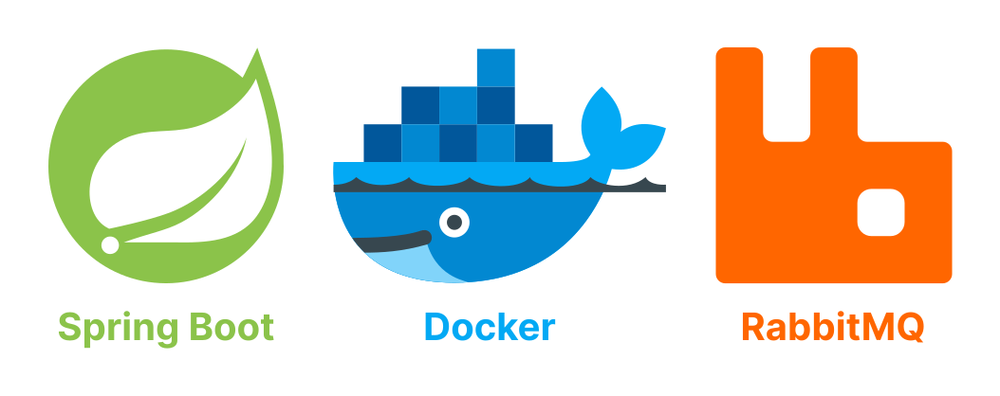
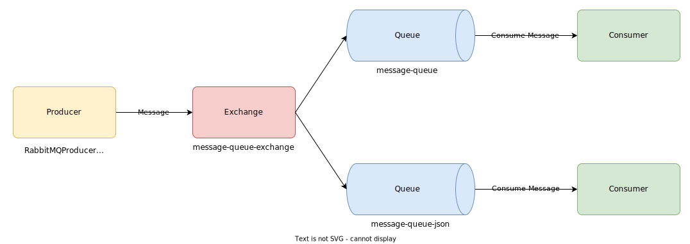

# Java Spring Boot + RabbitMQ



This repository demonstrates the basic usage of RabbitMQ integrated in a Java Spring Boot v3.1.5+ backend.

# 0. Technologies used

| Technology       | Version             |
|------------------|---------------------|
| Java Spring Boot | `v3.1.5`            |
| Docker           | `v24.0.6`           |
| Docker Compose   | `v2.22.0-desktop.2` |
| RabbitMQ         | `v3.12.7`           |

# 1. RabbitMQ

- RabbitMQ is a tool that helps different parts of a program to communicate with each other, even if they're not in the
	same place.
- This means that RabbitMQ makes sure that the messages get to the right place without data loss.
- It is specifically helpful when a lot of people are trying to send messages at the same time.

## 1.1. RabbitMQ Architecture



- Here RabbitMQ supports multiple messaging protocols and streaming.
- This Java Spring Boot REST API example covers the following operations with RabbitMQ integration:

1. Push a single message to queue.
2. Push a json message to queue.
3. Consume a single message from queue.
4. Consume json message from queue.

# 2. Test the API

| Endpoint                                   | Method | Description                            |
|--------------------------------------------|--------|----------------------------------------|
| `/api/v1/messages/json`                    | `POST` | Add a complex JSON object in RabbitMQ. |
| `/api/v1/messages/string?message={string}` | `GET`  | Add a string in RabbitMQ.              |

## 2.1. [POST] /api/v1/messages/json

Send a new message to RabbitMQ as a JSON object:

```shell
curl -X POST -H "Content-Type: application/json" -d '{
"id": 1,
"first_name": "John",
"last_name": "Doe"
}' http://localhost:8080/api/v1/messages/json
```

## 2.2. [GET] /api/v1/messages/string?message={string}

Send a new message to RabbitMQ as a string:

```shell
curl "http://localhost:8080/api/v1/messages/string?message=hello%20world" 
```
